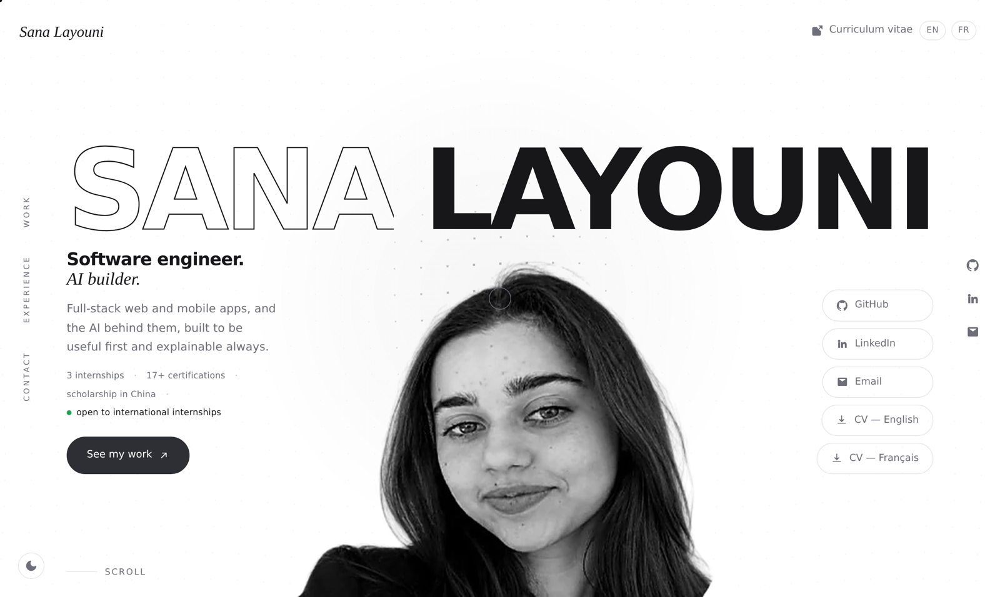

# sanalayouni.github.io

My personal portfolio — software engineering, AI and automation.
Live at **[sanalayouni.github.io](https://sanalayouni.github.io)**.



## What's here

A single-page site with three project case studies, built by hand with no framework and no build step. Every page is one self-contained HTML file.

- **Home** — intro sequence, projects, experience timeline, about, contact form
- **[HRHub](hrhub/)** — AI agents that read HR requests, check them against company policy and recommend a decision
- **[Ghibli Mori](ghibli-mori/)** — full-stack Studio Ghibli platform: film library, soundtracks, comments, JWT auth
- **[Synara](synara/)** — NLP dashboard that routes incoming emails to the right department with a confidence score

## Built with

HTML, CSS and vanilla JavaScript. No dependencies, no bundler.

Some of the details I enjoyed building:

- a headline that measures itself and resizes to fill the viewport exactly
- an intro sequence that plays once per session and can be skipped
- inertia scrolling with a parallax portrait that follows the cursor
- a light and dark theme that remembers the visitor's choice
- scroll-reveal, wipe and split-text animations, all disabled under `prefers-reduced-motion`
- a contact form posting to [Web3Forms](https://web3forms.com), with a honeypot field and a `mailto:` fallback if the request fails

## Structure

```
index.html          the whole homepage: markup, styles and script
cv-en.pdf           CV, English
cv-fr.pdf           CV, French
hrhub/              project page + screenshots
ghibli-mori/        project page + demo video and screenshots
synara/             project page + screenshots
```

## Running it locally

No install needed — open `index.html` in a browser.

To serve it over HTTP instead (closer to production):

```bash
python3 -m http.server 8000
# then open http://localhost:8000
```

## Contact

[sanalayouni20@gmail.com](mailto:sanalayouni20@gmail.com) · [LinkedIn](https://www.linkedin.com/in/sana-layouni/) · [GitHub](https://github.com/sanalayouni)
